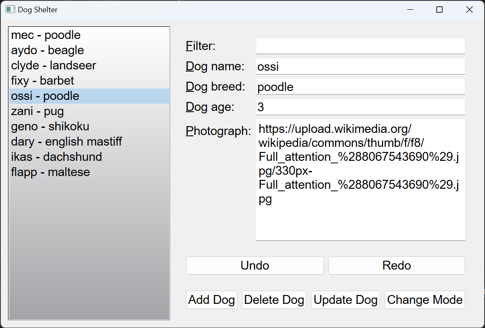
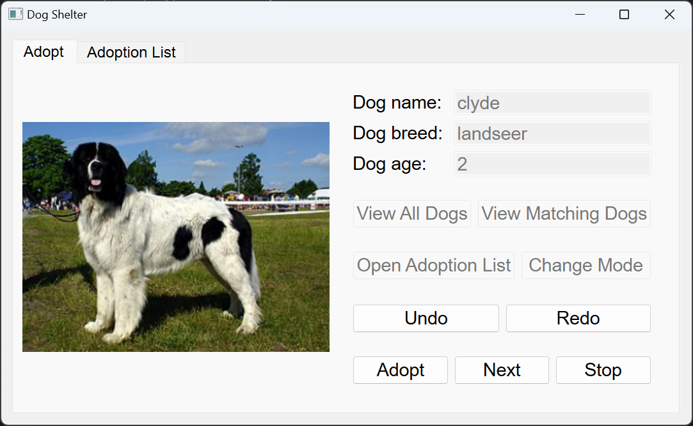
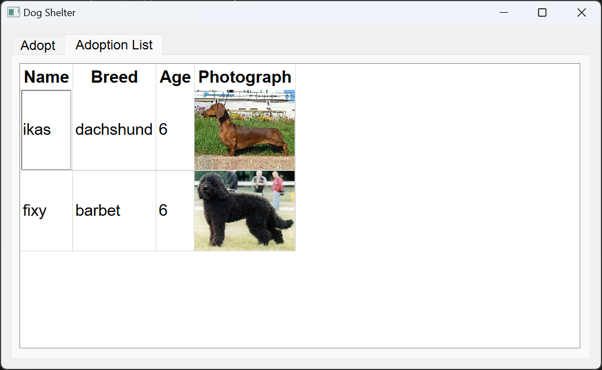

# Rescue Shelter

### [Rescue Shelter Console](Rescue%20Shelter%20Console)

A console-driven application that allows users to interact with a rescue shelter.

### [Rescue Shelter Qt](Rescue%20Shelter%20Qt)

The enhanced version of the application with a graphical user interface (GUI) built using Qt. This version also uses PostgreSQL as the database management system.

## Overview

This is a software application designed to assist in managing the adoption process of animals in a shelter. It offers functionalities in two modes: `administrator` and `user`. Administrators can manage the animal database, while users can browse, select, and adopt animals.

## Technologies

- C++ 20
- Qt 6.4.2
- PostgreSQL 15.2

## Features

- **Administrator Mode:**
  - Manage database: Add, delete, and update information.
  - View all animals in the shelter.
- **User Mode:**
  - Browse animals one by one with options to adopt.
  - Filter animals by age or other criteria.
  - View and manage the personal adoption list.
- **Additional Features:**
  - Use STL algorithms and C++11's ranged-based for loop.
  - Error handling using custom exceptions.
  - Adoption list saved in CSV or HTML format.
  - UML class diagram of the application.
  - Sort function using Comparator class template.
  - GUI without Qt Designer, including a gradient effect.
  - Multiple undo and redo functionality.
  - Qt View/Model components and custom Qt delegates.
  - Database-backed repository (PostgreSQL).
  - Custom SQL queries and prepared statements to prevent SQL injection.

See the console version's [REQUIREMENTS.md](./Rescue%20Shelter%20Console/REQUIREMENTS.md) file and the Qt version's [REQUIREMENTS.md](./Rescue%20Shelter%20Qt/REQUIREMENTS.md) file for more details.

## Installation

1. Clone the repository.

2. Restore the database using the `main.sql` file found in the `PostgreSQL` directory.

3. Create a `Config.h` file using the template and update the database connection details.

4. Build and run the application.

## Usage

- Choose the desired mode at the start of the application: `admin` or `user`.
- Follow the on-screen instructions to manage or adopt animals.
- Use the `Undo` and `Redo` buttons to revert or redo changes.
- View and manage the personal `Adoption List` in the designated tab.

## Preview

##### Admin mode

##### User Mode

##### Adoption List

## License

This project is licensed under the GNU General Public License v3.0 - see the [LICENSE](./LICENSE) file for details.
